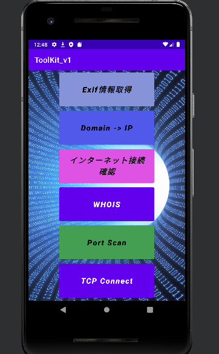
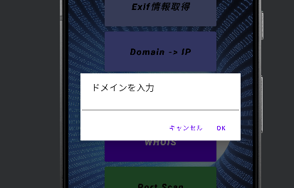
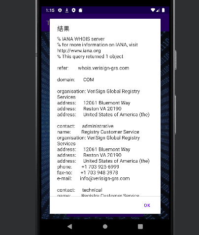
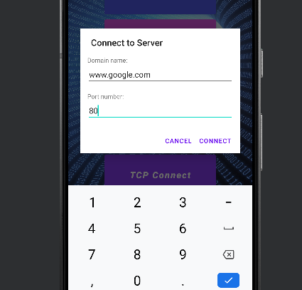
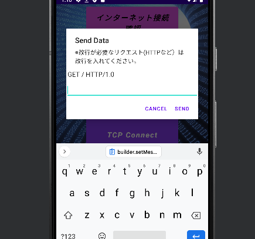

# Tool Kit
この後も機能を追加していきたい。 
アプリは`release/`にあります。

## Usage
コード簡略化のため全ての操作はダイアログを使用しています。 
<機能> 
・「Exif情報取得」...画像からexif情報を抽出します。 
・「Domain -> IP」...ドメイン名からIPアドレスを正引きします。 
・「インターネット接続確認」...インターネットに接続可能か確認します。自分のグローバルIPアドレスも取得します。 
・「WHOIS」...ドメイン名からwhois情報を取得します。 
・「Port Scan」...ドメイン名と(1つ)ポート番号を指定して、疎通確認を行います。 
・「TCP Connect」...Socketを使用してTCP接続を行います。  
見た目はこんな感じです。 

 
試しに「WHOIS」機能を使ってみます。 
ダイアログが表示され、ドメイン名を入力すると、結果が表示されます。 

 
次に、「TCP Connect」機能は、Socketを使用してTCP接続を行っているので、 
好きなリクエストを送信することができます。 

